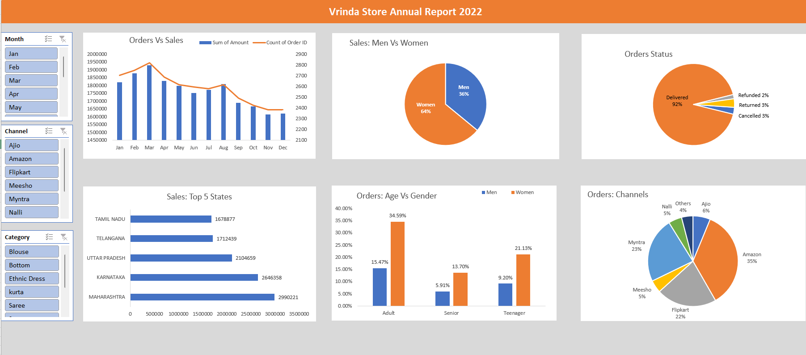

# 🧾 Vrinda Store Annual Report 2022 (Excel Dashboard)
## 📸 Preview Dashboard 

## 🎯 Mục tiêu dự án
Phân tích dữ liệu bán hàng của **Vrinda Store** trong năm 2022 nhằm:

- Hiểu rõ xu hướng mua hàng theo **thời gian, giới tính, độ tuổi, khu vực và kênh bán hàng**.  
- Xác định **nhóm khách hàng mục tiêu chính** giúp tối ưu chiến lược marketing và bán hàng năm tiếp theo.

---
## 📂 Nguồn dữ liệu
Dữ liệu gốc được cung cấp ở dạng **Excel** (~31.047 dòng), gồm các cột chính:

| Cột | Ý nghĩa |
|------|----------|
| Order ID | Mã đơn hàng |
| Cust ID | Mã khách hàng |
| Gender | Giới tính khách hàng |
| Age | Tuổi |
| Age Group | Nhóm tuổi (Teenager, Adult, Senior) |
| Date / Month | Ngày và tháng đặt hàng |
| Status | Trạng thái đơn hàng (Delivered, Cancelled, Returned, Refunded) |
| Channel | Kênh bán hàng (Amazon, Myntra, Flipkart, Meesho, …) |
| Category | Loại sản phẩm (Kurta, Saree, Set, Blouse, …) |
| Qty | Số lượng sản phẩm |
| Amount | Giá trị đơn hàng |
| Ship-State | Bang hoặc khu vực giao hàng |

---

## 🧹 Làm sạch và xử lý dữ liệu

Thực hiện trong **Excel**:

### 🔸 Chuẩn hóa dữ liệu
- Xóa dòng trống, định dạng lại kiểu dữ liệu (`Date`, `Amount`, `Qty`).
- Chuẩn hóa chữ hoa/thường trong các cột `Category`, `Channel`, `Gender`.

### 🔸 Tạo thêm các cột tính toán
- **Age Group:**  
  ```excel
  =IF(E2>=50,"Senior",IF(E2>=30,"Adult","Teenager"))
- **Month**: Trích xuất tháng từ cột Date.

### 🔸 Loại bỏ dữ liệu lỗi
Chỉ giữ lại các dòng có Status khác trống và Amount > 0.

## 📊 Phân tích và trực quan hóa
Tạo Excel Dashboard gồm 6 phần chính:

Orders vs Sales (theo tháng)

Cột: Tổng doanh thu (Sum of Amount)

Đường: Tổng số đơn (Count of Order ID)
→ Doanh số cao nhất vào tháng 3 và giảm dần về cuối năm.

Sales: Men vs Women

Biểu đồ tròn: tỷ lệ giới tính
→ Phụ nữ chiếm 64% doanh số, nam giới 36%.

Orders Status

Biểu đồ tròn thể hiện tỷ lệ trạng thái đơn hàng
→ 92% đơn Delivered, ~8% bị hủy/hoàn tiền.

Sales: Top 5 States

Biểu đồ thanh ngang: Top 5 bang có doanh số cao nhất
→ Maharashtra, Karnataka, Uttar Pradesh, Telangana, Tamil Nadu.

Orders: Age vs Gender

Biểu đồ cột chồng
→ Nhóm Women Adults (26–50 tuổi) chiếm ≈35%.

Orders by Channel

Biểu đồ tròn: tỷ lệ đơn theo kênh bán hàng
→ Amazon (35%) và Myntra (23%) là hai kênh mạnh nhất.

## 💡 Insight chính
👩‍🦰 Nhóm khách hàng chủ lực: Phụ nữ độ tuổi Adult (26–50) chiếm hơn 60% doanh thu.

🛒 Kênh hiệu quả nhất: Amazon và Myntra → cần tập trung quảng bá, ưu đãi.

📉 Doanh số giảm dần từ giữa năm → nên thúc đẩy chiến dịch mùa thu/đông.

🗺️ Thị trường trọng điểm: Maharashtra & Karnataka.

## 🧠 Kết luận
Từ dữ liệu 2022, Vrinda Store nên tập trung vào:

Khách hàng nữ trưởng thành (26–50 tuổi).

Hai kênh Amazon và Myntra.

Duy trì chất lượng giao hàng (Delivered 92%).

Tăng chiến dịch vào nhóm sản phẩm Kurta, Set, Saree và khu vực Maharashtra, Karnataka.

## 🛠️ Công cụ sử dụng
Excel (PivotTable, Slicer, Chart, Dashboard Layout)
Data Cleaning & Transformation
Visualization & Analysis
## 📁 File đính kèm
Vrinda_Store_2022_Analysis.xlsx — file xử lý & dashboard hoàn chỉnh
README.md — mô tả dự án 
